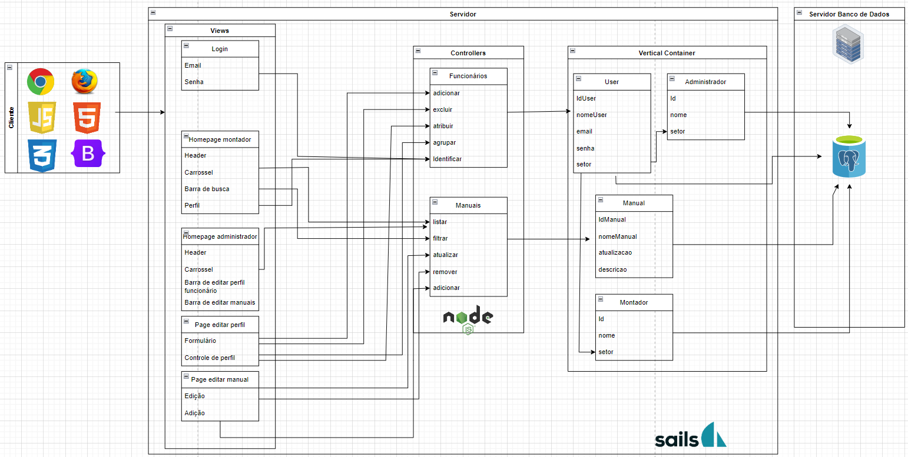

# Developers
# 1. Introdução
&nbsp;&nbsp;&nbsp;&nbsp; A empresa Dell notou uma dificuldade em seu sistema de instrução de montagem, uma vez que sua forma de disponibilizar os manuais para os funcionários estava obsoleta. A plataforma não era personalizada e os administradores tinham poucas opções para coordenar e ter controle do que os usuários faziam. Desta forma, o produto exemplificado no MVC abaixo tem como função ser personalizado para os usuários, além de permitir que realizem todas as tarefas que desejam, de forma lógica e clara. A experiência do usuário é outro fator muito importante nesta aplicação web.
# 2. Ferramenta e MVC
&nbsp;&nbsp;&nbsp;&nbsp; A seguir, tem-se a imagem que representa o MVC, feita por meio da ferramenta draw.io.

Figura 1 — Template 5 Forças de Porter

Fonte: Material produzido pelos autores (2024)

Link para acesso do draw.io: https://app.diagrams.net/#G1rmTKbXm9M43NTqJKjYFFHAEvSCPf69dz#%7B%22pageId%22%3A%22Eu36n1lIrW9r5AbXWAcV%22%7D

# 3. Modelos (Models)

&nbsp;&nbsp;&nbsp;&nbsp;Responsável pelo acesso e manipulação dos dados na sua aplicação. Seguindo essa linha de raciocínio, tem-se as seguintes ferramentas que constituem este mecanismo.

&nbsp;&nbsp;&nbsp;&nbsp;Em entidades vale destacar as duas principais que são o user e manual, como próprio nome já diz uma representa as informações dos manuais e outra dos usuários. 

&nbsp;&nbsp;&nbsp;&nbsp;Dentro da entidade user existem os seguinte atributos: 
“idUser”- Que funciona como um número de identificação na qual cada usuário terá o seu. Além disso, terão outros atributos que funcionam como cadastro para a realização do login, sendo eles “nomeUser”, “email” e “senha”. Outro que deve ser destacado é o “setor”, no qual irá identificar qual o trabalho realizado pelo usuário, ou seja, terão números ou nomes para cada tipo de trabalho ou linha de produção, ex: linha1, linha2, administrador.

&nbsp;&nbsp;&nbsp;&nbsp;Dentro da entidade manual, terá os seguintes atributos: “id Manual”, que funciona no mesmo modelo do usuário, será para a identificação do manual específico. Terá também, “o nomeManual”, que será o que o usuário irá pesquisar, sendo baseado principalmente nos produtos que serão montados, ou seja, se o usuário pesquisar por exemplo: Manual “determinado notebook da linha dell”. Atributo “atualização”: representa a data da última atualização que o manual teve, ou seja, os usuários poderiam observar as datas de atualizações, além de poder visualizar a data de um manual que acabou de ser adicionado. E por último, teria a “descricao”, que seria uma mensagem breve sobre cada manual, explicando para que serve e para qual produto é atribuído às informações deste. 

&nbsp;&nbsp;&nbsp;&nbsp;Além desses dois, há outras duas entidades, das quais observa-se que fazem ligação com a entidade user. Vale destacar que essa ligação é chamada de relacionamento, que é um conceito atribuído a ligação de duas entidades. Vale destacar que tanto a entidade “administrador” quanto à “montador”, possuem dois elementos que possuem uma chave estrangeira que ligam com o users, sendo ela o atributo setor, uma vez que ele é o responsável por identificar qual é o tipo de trabalho que cada um realiza dentro da empresa, sendo capaz de distinguir ambas características de usuário, influenciando nas páginas que poderão ter acesso. E dentro dessas entidades terão informações já explicadas anteriormente como “id” e “nome”. 

# 4. Controladores (Controllers)
&nbsp;&nbsp;&nbsp;&nbsp;O controller é a camada de controle, responsável por ligar o model e a view, fazendo com que os models possam ser repassados para as views e vice-versa.
Desta forma, na figura apresentada anteriormente pode ser observado dois controllers, são eles: Funcionários e Manuais. 
O controller Funcionários é responsável por representar todas as ações que o usuário pode realizar dentro da aplicação Web. já o Manuais, representam tudo aquilo que pode ser feito com relação aos manuais, desta forma todas as edições e atribuições que podem ser feitas. 
#### Em funcionários, são apresentados os métodos:
* Adicionar- Que está ligado a ação de adicionar membros no site, podendo ser realizada somente pelo administrador. 

* Excluir- Como nome já diz, é o método de excluir um usuário que possivelmente saiu da empresa.
* Atribuir- Está ligado a atribuição de uma tarefa ao usuário, ou seja, algo que ele deve realizar.
* Agrupar- No caso está ligado a capacidade de alocar uma pessoa em um setor, que representa uma espécie de grupo.
* Identificar- Está relacionado, com a identificação dos usuários, uma vez que no view cada um poderá olhar suas informações de cadastro e o administrador poderá visualizar também as informações de todos os colaboradores.

#### Em manuais, são apresentados os seguintes métodos: 
* Listar- Que está ligado com a listagem de todos os manuais disponíveis para cada tipo de usuário, na página principal dos colaboradores e administradores.
* Filtrar- Que funciona como uma espécie de filtro, no qual cada usuário pode definir o que quer ter acesso com base em uma descrição do manual, como por exemplo: o usuário coloca no filtro ligação de componentes, irá mostrar pra ele todos os manuais que estão ligados às conexões entre componentes.
* Atualizar- É um método ligado à possibilidade de substituição de um manual já existente por um de essência igual mas com atualizações que corrigem alguns problemas ou agilizem no processo de montagem, sendo mais eficiente que o anterior.
* Remover e adicionar- Está ligada com a possibilidade de excluir ou adicionar um manual, sendo ligada com a página editar manual do view sendo a entrada, e a saída é o manual do Modell, uma vez que ele vai acessar os atributos desta entidade.

# 5. Views (Views)
&nbsp;&nbsp;&nbsp;&nbsp; As views são responsáveis pela interface que será apresentada, mostrando as informações do model para o usuário. Dentro do MVC representada pela imagem vista anteriormente, tem-se as seguintes páginas: 
* Login- Sendo a primeira página na qual todos os usuários terão contato, na qual vão alocar seus dados nos espaços delimitados e com base nestes seguirão o fluxo dentro da aplicação.
* Homepage montador- Caso seja identificado que o usuario trabalhe como um montador, ele será direcionado a essa página, na qual poderá visualisar seus dados e todos os manuais dos quais possui acesso.
* Homepage administrador- Caso o usuário seja um administrador, ele será direcionado para esta página, da qual terá uma aparência parecida com a pagina do montadores, mas com um barra de tarefa que apresentem a possibilidade de realizar algumas outras ações que somente estes podem realizar.
* Page editar perfil- Nesta página estão presentes funções de edição de perfil para o administrador.
* Page editar manual- Nesta página estão presentes funções de edição de manual para o administrador.

# 6. Infraestrutura
&nbsp;&nbsp;&nbsp;&nbsp; Agora voltada para a estrutura do projeto, tem-se a utilização do banco de dados, do qual irá armazenar todas as informações necessárias para que o site funcione, guarda por exemplo o nome de um usuário e torna possível acessar este a qualquer momento. Já quando o assunto são as APIs, o projeto apresenta as seguintes: PostgreSQL que  é o sistema de gerenciamento de banco de dados relacional de objeto de código aberto. Outro é o DBeaver é um aplicativo de software cliente SQL e uma ferramenta de administração de banco de dados.
#### Como a infraestrutura se integra à arquitetura MVC:
&nbsp;&nbsp;&nbsp;&nbsp; A integração entre a infraestrutura e a arquitetura MVC é essencial para o funcionamento eficaz de uma aplicação web. A infraestrutura fornece os recursos necessários para executar e suportar a aplicação, enquanto a arquitetura MVC organiza e separa os componentes da aplicação de forma a facilitar o desenvolvimento, manutenção e escalabilidade.

  
 

 

